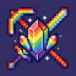
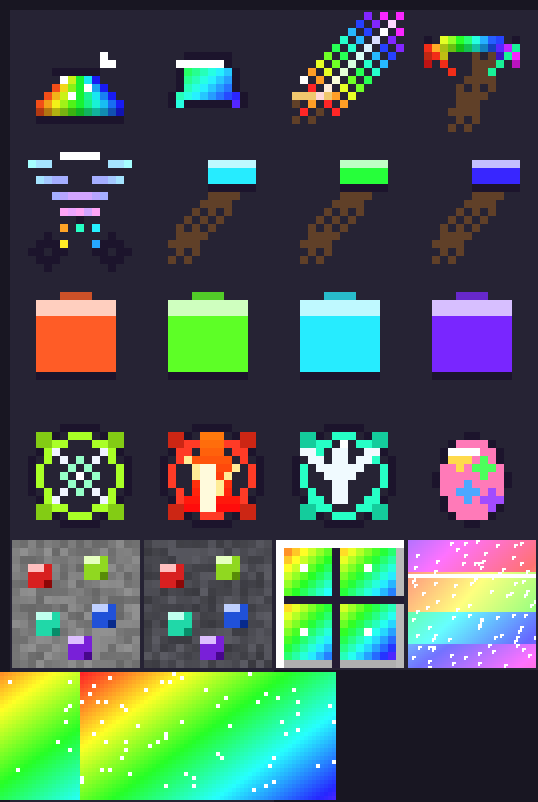

# Rainbow Magic

A Minecraft Bedrock Edition add-on: mine the rainbow, forge gear that cannot be
broken, and tame the pet that comes with it.

Everything is crafted from **rainbow ore**, which generates underground in the
Overworld.



*The last cell is the unicorn's texture: a UV atlas the vanilla horse model
wears, not a picture of the animal.*

## What is in it

| Thing | What it does |
| --- | --- |
| **Rainbow Ore** / **Deepslate Rainbow Ore** | Generates underground. Drops 1–3 Rainbow Dust. |
| **Rainbow Dust** → **Rainbow Ingot** | Smelt dust in a furnace. Everything else is made from ingots. |
| **Rainbow Blade** | **100 attack damage** and it never breaks. |
| **Rainbow Pickaxe** | Mines everything, **including bedrock**, and never breaks. |
| **Rainbow Axe** / **Shovel** / **Hoe** | The rest of the tool set, matching vanilla shapes, and none of them break. |
| **Rainbow Shears** | Shear **any** mob in the game, not just sheep. |
| **Rainbow Armour** | Helmet, chestplate, leggings and boots: diamond-grade protection and never breaks. |
| **Magical Traps** ×3 | Consumable traps that arm the ground you are standing on and fire at the first mob to walk onto it. |
| **Rainbow Glitter Unicorn** | A kind, glowing pet. Feed it a Rainbow Ingot to tame it. |

> **The art is generated, then imported.** All 24 images come from the prompts in
> [`docs/ART-PROMPTS.md`](docs/ART-PROMPTS.md), generated as one sheet per asset
> class, and brought into the pack by
> [`tools/import-art.py`](tools/import-art.py) — every reduction is a whole number,
> so nothing is ever resampled. `tools/make-textures.py` draws stand-ins for a
> fresh checkout and will not overwrite imported art unless you pass `--force`.

## How it works

### The blade, and why nothing wears out

The blade carries `"minecraft:damage": {"value": 100}`, so the engine adds 100 to
the player's own attack — that is data, straight from the item file. The object
form is the one vanilla uses (`{"value": <int>}`); a bare number is not.

Nothing in the pack has a `minecraft:durability` component **at all**. That is
what makes the blade, the pickaxe and the shears unbreakable: an item with no
durability can never take damage, so it can never break. There is no script
repairing them behind your back.

### The pickaxe, and bedrock

Two mechanisms, because no single one covers "everything":

- **Ordinary blocks** go through the item's own `minecraft:digger` speeds: four
  entries, one per block tag (pickaxe, axe, shovel, hoe), each at speed 20.
- **Blocks no tool can break** — bedrock, barrier, command blocks, jigsaw, light
  block, structure void, end portal frame, reinforced deepslate — are the one
  thing a data file cannot reach. `scripts/main.js` listens for the swing
  (`entityHitBlock`) and removes the block itself, dropping it. These blocks can
  never be *mined*, so no break event ever fires for them; the swing is the only
  hook that exists.

Portals are deliberately **not** on that list. Breaking an end portal or a
nether portal would wreck a world for no fun.

**The digger needs `format_version` 1.26.20 or later.** A `destroy_speeds` entry
that names a block *tag* rather than a block id is only understood from that
version; below it the entry is accepted and matches nothing. That matters more
than it sounds: `destroy_speeds` acts as the item's whitelist, so a digger whose
every entry matches nothing **mines nothing at all** — which is exactly what the
first play-test found. `rainbow_pickaxe.json` therefore declares `1.26.50`, which
is why the pack's `min_engine_version` is `1.26.50` and not lower.
`tools/check-pack.py` fails any tag descriptor below that version.

**A digger also needs `minecraft:is_tool`.** The item carries
`{"tags": ["minecraft:is_tool", "minecraft:is_pickaxe", "minecraft:diamond_tier"]}`.
Every canonical "is this a pickaxe" test in the documentation pairs `is_tool` with
the tool tag — an item tagged `is_pickaxe` alone is not treated as a tool at all,
so blocks **break and nothing is harvested**, which is what "it breaks but does
not mine" turned out to mean.

The pack's own blocks carry `minecraft:is_pickaxe_item_destructible` for the same
reason: a block without it is not pickaxe-destructible, so the digger's tag
descriptor never matches it either.

### Supershears

Shearing is a script interaction (`playerInteractWithEntity`). A mob with its own
drop gets it (a cow gives leather, a snow golem gives snowballs); **every other
mob in the game gives Rainbow Dust** — including mobs another add-on adds, because
the fallback is what handles them, not a list.

A sheared mob needs 30 seconds before it can be sheared again, so one cow cannot
be clicked into an infinite farm.

### The traps

A trap is a consumable item. Right-click the ground to arm it where you stand;
the item is spent, and the first mob to walk onto that spot takes the effect.
Your own pet is ignored, and so are you.

| Trap | Recipe | Effect on the mob |
| --- | --- | --- |
| **Snare** | 1 ingot + 4 string → 2 | Slowness IV for 5s, 6 damage |
| **Inferno** | 1 ingot + 4 blaze powder → 2 | Set on fire for 8s, 8 damage |
| **Levity** | 1 ingot + 4 feather → 2 | Levitation V for 3s, 4 damage |

Traps are **per session**: they are not written to the world, so they are gone
after a reload. They are cheap on purpose — throw them down mid-fight.

### The Rainbow Glitter Unicorn

The unicorn reuses the vanilla horse model, wearing a rainbow glitter texture
drawn for this pack, so it animates properly without shipping a custom model.

It is tameable: **feed it a Rainbow Ingot** and it follows you. On spawn the
script gives it glowing (so you can find it) and regeneration (so it is kind
rather than merely harmless). It gives rainbow dust when it dies, and you can
shear it too.

## Crafting

| Item | Recipe |
| --- | --- |
| Rainbow Ingot | Furnace or blast furnace: 1 Rainbow Dust |
| Rainbow Block | 9 Rainbow Ingots in a 3×3 |
| 9 Rainbow Ingots | 1 Rainbow Block, anywhere in the grid |
| Rainbow Blade | Ingot over ingot over stick (a sword shape) |
| Rainbow Pickaxe | 3 ingots across, stick, stick (a pickaxe shape) |
| Rainbow Axe | 2 ingots over ingot+stick over stick (an axe shape) |
| Rainbow Shovel | Ingot over stick over stick (a shovel shape) |
| Rainbow Hoe | 2 ingots over stick over stick (a hoe shape) |
| Rainbow Shears | 2 ingots diagonally (a shears shape) |
| Rainbow Helmet | 5 ingots in an arch |
| Rainbow Chestplate | 8 ingots (a chestplate shape) |
| Rainbow Leggings | 7 ingots (a leggings shape) |
| Rainbow Boots | 4 ingots, two and two |
| Unicorn Spawn Egg | 1 Rainbow Block + 1 Golden Apple + 4 Rainbow Dust |

Ore generates from **y −60 to y 60**, in veins of up to 6, eight attempts per
chunk, so it is common enough to build a sword early and still worth digging for.

## Installation

**On a phone or console:** download `rainbow-magic.mcaddon` from the
[Releases](https://github.com/thani-sh-momo/rainbow-magic/releases) page and open
it. Minecraft imports both packs. Then enable them in your world's settings.

**On a world from a file:** open the `.mcpack` files the same way, or unzip them
into `behavior_packs/` and `resource_packs/`.

### Dedicated server setup

Both packs are needed — the behavior pack holds the items, recipes and ore, and
the resource pack holds the textures. There is no script API toggle to flip, and
**no experiments are required**: everything here uses release features, with one
floor worth stating plainly — **Bedrock 1.26.50 or newer**. The rainbow pickaxe
needs `format_version` 1.26.20 for its tag-based `destroy_speeds`, so the pack
declares `min_engine_version` `1.26.50` and an older server rejects it with a
clear version error rather than loading a pickaxe that cannot mine.

1. **Get the packs.** Clone this repository and use `behavior/` and
   `resource-pack/`, or rename the release `.mcpack` files to `.zip` and extract
   them.
2. **Copy them in**, keeping each folder's `manifest.json` directly inside:

   ```text
   <server>/
   ├── behavior_packs/
   │   └── rainbow-magic/          <- behavior/manifest.json lives here
   ├── resource_packs/
   │   └── rainbow-magic/          <- resource-pack/manifest.json lives here
   ├── server.properties
   └── worlds/
       └── Bedrock level/
   ```

3. **Activate both for the world.** Edit `worlds/<level-name>/world_behavior_packs.json`
   and `worlds/<level-name>/world_resource_packs.json`, creating them if they do
   not exist. Use each manifest's `header.uuid` — the header, not a module:

   ```json
   [
     { "pack_id": "bc2a68d1-58da-4029-b56d-82538d854be0", "version": [1, 0, 8] }
   ]
   ```

   The resource pack's header uuid is `d8c6e08f-adbf-4b82-a242-44aa79e4a376`.

4. **Restart the server** and watch for pack-loading errors.
5. **Confirm it loaded.** Add `content-log-file-enabled=true` to
   `server.properties` and restart: the add-on's `RainbowMagic: ...` lines then
   appear in the content log in the server root.

### Building the packs

```bash
python3 tools/build-addon.py     # writes dist/*.mcpack and dist/*.mcaddon
python3 tools/import-art.py DIR  # brings one image per asset into the pack
python3 tools/import-art.py --sheets DIR   # or the five-sheet layout instead
python3 tools/make-textures.py   # redraws stand-in textures (needs --force to replace art)
```

## Tests

Two checks, both runnable without Minecraft:

```bash
npm test                      # 37 tests: what the script does, under a test double
python3 tools/check-pack.py   # every id, texture and cross-reference resolves
```

`npm test` loads `behavior/scripts/main.js` exactly as it ships, with
`test/stub/minecraft-server.mjs` standing in for the game's Script API, and
asserts what the add-on *did* — destroyed this block, dropped that item, armed
that trap, spent that item — rather than what it logged. Node 22 or newer; there
are no dependencies to install.

`check-pack.py` is the other half: item icons that name a texture nobody drew,
recipes whose result is not defined, a `places_feature` that points at nothing.
Every id in a pack is a string only the game resolves, so a typo there is silent.

### What is verified, and what needs the game

Run and passing here:

- **All scripted behaviour** — the pickaxe on every block on its list, the
  shears on named and unnamed mobs, cooldowns, trap arming, spending and firing,
  and the unicorn's spawn effects (59 tests).
- **Every data cross-reference** — manifests, uuids, textures, recipes, loot
  tables, features and the entity's client definition.
- **The archives** — built and checked for a `manifest.json` at the root.

### Bugs the game found, and what now stops them coming back

Every one of these passed a static check before it shipped, so each fix comes
with a gate that fails when the fix is reverted — five for five, verified by
reverting them one at a time.

| Found by | Bug | Now gated by |
| --- | --- | --- |
| Loading the first build | `minecraft:icon` written as an object; that form needs a newer schema than the declared format version | the icon must be a bare texture name |
| Loading the first build | All nine crafting recipes refused for want of `unlock` data | a shaped or shapeless recipe must carry `unlock` |
| Play-testing | The ore and every custom block rendered as the missing-texture placeholder | a block must declare `minecraft:geometry`, and its texture shortname must be namespaced and present in `terrain_texture.json` |
| Play-testing | The pickaxe mined nothing at all | a tag descriptor in `destroy_speeds` requires `format_version` 1.26.20+ |
| Play-testing | `addEffect("glowing", …)` threw `InvalidArgumentError` | every effect name must be a Bedrock effect |
| Play-testing | The pickaxe still mined nothing: `tag:minecraft:is_pickaxe` is old syntax and the current schema rejects the item, dropping **every** component on it | no component key may start with `tag:`, and `minecraft:tags` must be an object with a `tags` array |
| Reading vanilla's own `diamond_spear.json` | `minecraft:damage` was a bare number where vanilla writes an object | `minecraft:damage` must be `{"value": <int>}` |
| Play-testing | `animation.horse.v3.look_at_player` spammed the log: `query.head_y_rotation` is accepted only on vanilla horse-family types | a custom entity must not reference that animation |
| Play-testing | The pickaxe broke blocks but **harvested nothing**: the item declared `minecraft:is_pickaxe` and `minecraft:diamond_tier` but not `minecraft:is_tool`, so the engine never treated it as a tool | an item with a `minecraft:digger` must declare `minecraft:is_tool`; a block's `minecraft:tags` must be an array, not the item's object form |
| Play-testing | Armour would have been **wearable but invisible**: a `minecraft:wearable` item needs an attachable in the resource pack | every wearable in an armour slot must have an attachable declaring it, with a real texture and a render controller |

**Still not verified**, because the engine owns these — worth a look in play:

- **Whether the shears drop twice on the mobs vanilla already shears.** Now that the item
  carries `minecraft:is_shears`, the engine may shear a sheep itself *and* let the script
  spawn its own wool. If sheep start giving suspiciously generous wool, that is why.

- **Whether the engine raises `playerInteractWithEntity` at all with a custom item in hand.**
  The shears now carry `minecraft:is_shears` and `minecraft:is_tool`, so the engine should shear
  sheep, mooshrooms and snow golems natively; the script extends that to every other mob. If
  shearing still does nothing, the log's first three entity interactions say whether the event
  fires, and what the engine believes is in your hand — that distinguishes "the item is not
  recognised" from "the event never arrives", which is the one thing a data file cannot tell us.

- `minecraft:damage: 100` on the blade (does 100 damage land as intended, or does
  the engine clamp it?),
- whether **obsidian and ancient debris drop** when mined with the rainbow
  pickaxe. The engine's `minecraft:diamond_tier_destructible` tag says those
  blocks need a diamond-tier tool *to drop*, and a custom item has no tier. If
  they break but give nothing, say so and they move to the script's own
  break-and-drop list,
- rainbow ore actually generating,
- the unicorn's model and taming, and whether the crafted spawn egg links to it
  the way a vanilla egg does (the creative-menu egg is the fallback),
- the particle and sound ids the traps use.

## If it will not load

The script module logs its own progress, because the failure it guards against
is invisible: **a script that throws while loading takes the pack down and says
nothing at all** — no content-log entry, no error, just a pack that will not
load. Everything below is one line in the content log per stage.

**Turn the content log on first**, or there is nothing to read:

- *Dedicated server:* add `content-log-file-enabled=true` to `server.properties`
  and restart. The log is written to the server root.
- *Client:* Settings → Creator → **Content Log GUI** (and enable the content log
  in the same section).

Then look for lines starting `[RainbowMagic]`. A healthy load looks like this:

```text
[RainbowMagic] build 1.0.10: script module loaded
[RainbowMagic] afterEvents: entityHitBlock=ok entitySpawn=ok itemUse=ok ...
[RainbowMagic] currentTick=0
[RainbowMagic] overworld=minecraft:overworld
[RainbowMagic] players=0
[RainbowMagic] subscribed: entityHitBlock
... one line per subscription ...
[RainbowMagic] subscribed: interval every 10 ticks
[RainbowMagic] boot sequence complete
[RainbowMagic] alive in the world at tick 10, players=1
[RainbowMagic] content: items 9/9, blocks 3/3
```

Read it like this:

| What you see | What it means |
| --- | --- |
| **No `[RainbowMagic]` line at all** | The script module never ran. The problem is the manifest, the script module entry, or the `@minecraft/server` version — not the items, blocks or textures. |
| `build …` but no `boot sequence complete` | Something threw during setup; the line above it names what. |
| `cannot subscribe to <event>` | This engine's script API has no such event, so that feature is off. The rest still runs. |
| `<name> handler threw:` | A named handler failed at runtime, with the error and stack. |
| Boot lines but **no** `alive in the world` | The script loaded but its tick loop never ran. |
| `content: items 9/9, blocks 3/3` | The behaviour pack's data loaded and the engine knows every item and block. |
| `content: … MISSING <id>` | The script loaded but those items or blocks did not register — a data problem, with the ids named. |

The script can run while the rest of the pack does not, which is why "the
script works" is not the same as "the pack loaded". The `content:` line is what
separates them.

### Bisecting the two packs

The release also carries the packs separately:
`rainbow-magic-behavior.mcpack` and `rainbow-magic-resources.mcpack`. Installing
one at a time says which pack is unhappy:

1. **Resources alone** on a fresh test world — if the load error still appears,
   the resource pack is the problem and the behaviour pack is innocent.
2. **Behaviour alone** — likewise the other way round.

### "At least one of your behaviour or resource packs failed to load" with an empty log

**Check this before touching the pack: it is a known Bedrock bug that fires with
no packs installed at all.** Mojira **MCPE-241656** is Confirmed and reviewed by
Mojang's triage team: the message appears when loading a world, during play, and
"even after a clean installation with no active packs", on 26.50 and later —
*"No actual pack loading failure is observed; worlds load and run normally
except for this persistent chat warning."* **MCPE-242853** reports the same on a
26.51 fresh world with no custom packs. A commenter on the report puts it
plainly: *"I keep getting it, only to find that the packs I'm using are working
just fine."*

The 30-second test that separates the bug from a real fault:

1. Create a fresh world and enable **no packs at all**. If the message appears
   anyway, it is the engine's bug and says nothing about this add-on.
2. Then check the add-on for **real** symptoms rather than the message — in
   creative, search `Rainbow`: all nine items should be there with their proper
   rainbow art. A checkerboard or missing texture means the resource pack really
   did not load. Build a rainbow block and place it; the ore art is the same
   test for blocks.

A pack that genuinely failed also leaves pack-validation lines in the content
log (`[Item]`, `[Texture]`, `[Recipes]`) — that is how the first two schema
errors in this add-on were found. Silence plus this message is the bug.

If it *is* a real fault, and only then: the release carries the packs separately
(`rainbow-magic-behavior.mcpack`, `rainbow-magic-resources.mcpack`), so
installing one at a time says which pack is unhappy.

**Versions.** A world records a pack's uuid **and version**; an unchanged version
after a rebuild can leave the world using the copy it already has, so the
version in `manifest.json` (this file documents `1.0.10`) is what
`world_behavior_packs.json` and `world_resource_packs.json` must name. Version
bumps are for content changes only — a documentation change does not need one,
and bumping needlessly makes a world's stored reference go stale.

## Contributing

Open a pull request against `main`. Run both checks above before you push, and
say what you verified in the description — a change that adds an item needs
`check-pack.py` clean, and a change to `scripts/main.js` needs a test.

## License

MIT — see [LICENSE](LICENSE).
